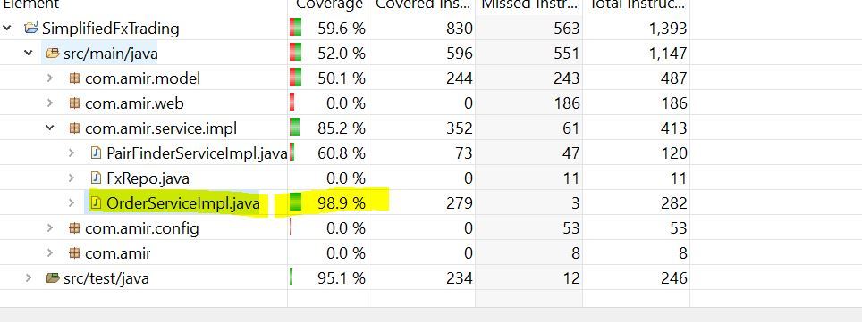
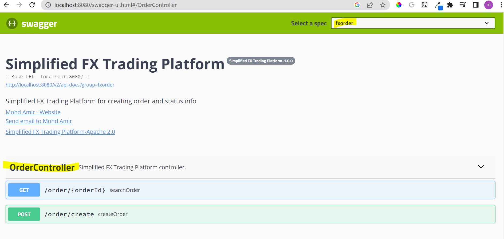

Swagger URL:(for API documentations)
-------------------------------------
	http://localhost:8080/swagger-ui.html

postman collection script
-------------------------------
	FxTrading.postman_collection.json you can file this files inside root dir.

code coverage snapshot.
-------------------------

swagger-ui snapshot
-----------------------

